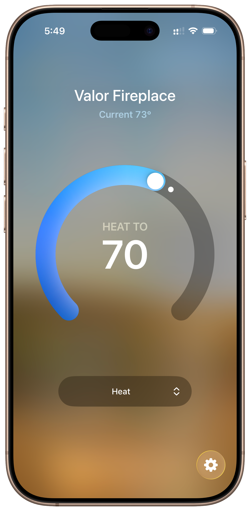

# homebridge-valor-fireplace

[](https://www.npmjs.com/package/homebridge-valor-fireplace)
[](https://www.npmjs.com/package/homebridge-valor-fireplace)

[Homebridge](https://github.com/homebridge/homebridge) plugin for controlling Valor fireplaces with WiFi controllers through Apple HomeKit.

<p align="center">
  
</p>

## Features

Control your Valor fireplace using Siri and schedule automations with HomeKit scenes. The plugin exposes a Heater accessory with the following features:

| Feature | Description |
|---------|-------------|
| Lock Controls | Lock access to fireplace controls (turn off is always available for safety) |
| Temperature Mode | Set to HEAT in HomeKit for temperature-controlled operation |
| Manual Mode | Direct flame control |
| Eco Mode | Set to COOL in HomeKit for eco mode |
| Auxiliary | Toggle auxiliary features using the Oscillate switch |

## Installation

### Via Homebridge UI (Recommended)

Search for "valor-fireplace" in the Homebridge UI plugin search and install.

### Via Command Line

```bash
npm install -g homebridge-valor-fireplace
```

## Configuration

### Via Homebridge UI

Configure the plugin through the Homebridge UI settings panel.

### Manual Configuration

Add the following to your Homebridge `config.json`:

```json
{
  "platforms": [
    {
      "platform": "ValorFireplace",
      "fireplaces": [
        {
          "name": "Living Room Fireplace",
          "ip": "192.168.1.100"
        }
      ]
    }
  ]
}
```

### Configuration Options

| Key | Required | Description |
|-----|----------|-------------|
| `platform` | Yes | Must be `"ValorFireplace"` |
| `debug` | No | Enable debug mode to log all status updates (default: false) |
| `temperatureUnit` | No | Temperature unit for logs: `"C"` for Celsius, `"F"` for Fahrenheit (default: `"C"`) |
| `fireplaces` | Yes | Array of fireplace configurations |
| `name` | Yes | Display name for the fireplace (also used as serial number) |
| `ip` | Yes | Static IP address of the fireplace WiFi controller |

## Requirements

- Valor fireplace with WiFi controller (B6R-WME or compatible)
- Static IP address assigned to the fireplace controller
- Homebridge 1.3.5 or later
- Node.js 14.18.1 or later

## Legal

*Valor* is a registered trademark of Valor Fireplaces.

*Mertik* is a registered trademark of Maxitrol GmbH & Co. KG.

This project is not affiliated with, authorized, maintained, sponsored, or endorsed by Valor Fireplaces, Maxitrol, or any of their affiliates or subsidiaries.

## Credits

This plugin is based on [homebridge-mertik-fireplace](https://github.com/tritter/homebridge-mertik-fireplace) by [@tritter](https://github.com/tritter).

Protocol implementation assistance from [@erdebee's homey-mertik-wifi](https://github.com/erdebee/homey-mertik-wifi).

## License

Apache-2.0
